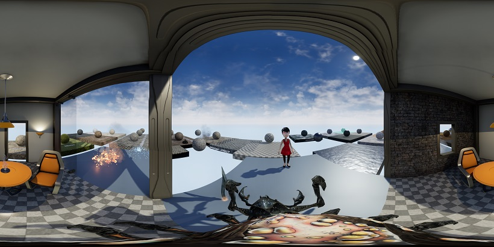

# Unreal-Omnidirectional-Stereo-Camera

This plugin adds a new Camera Class to Unreal which can be used to render Omnidirectional Stereo Images. 

## About
- Rathen than output full images directly, this outputs the array of images plus a TXT file required to make a smoooth stich using "PTStitcher" or "PTMender", similar to what Ansel does behind the scenes.

- This automatically takes the rotation of the camera into account

- Uses LevelSequencer to automatically set Fixed Framerate, and output files with exact framenumbers

- This is not for Game snapshots, however instead for recordering a scene which is pre-animated with the Sequencer (Usefull for VR or 360 Rides)

## Plugin Usage
Usage instructions found here: [user manual page](USAGE.md).
